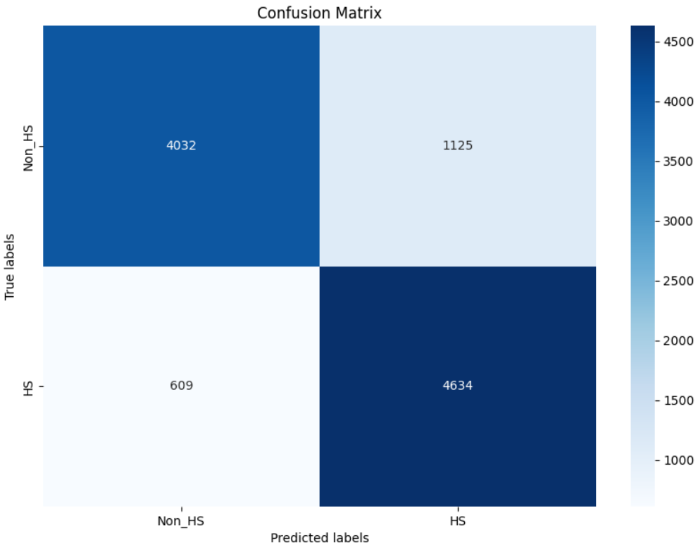

# Hate Speech Detection in Indonesian Social Media Posts

Juan Kenichi Sutan

CIS 4360 Sec. 004 Spring 2024

Dr. Jumanah Alshehri

Temple University

May 6, 2024

# Abstract

Hate speech is a prevalent issue in online communities, including those speaking
Indonesian. This project addresses the issue of detecting hate speech in Indonesian social media
using a Natural Language Processing (NLP) model. Using an existing dataset and a traditional
machine learning approach, we develop an NLP classification model based on term frequency and
logistic regression. The model’s performance is evaluated using standard metrics such as accuracy,
precision, recall, and F-1 score. Despite achieving promising results, the model exhibits limitations
that can be attributed to both methodological issues within the model and linguistic challenges
inherent to Indonesian. These challenges include inconsistent spelling, code-mixing, and the
scarcity of language resources. Addressing these challenges requires refining the methodology
used but also advancing research in Indonesian NLP in general, especially approaches for low-
resource languages at large.

# Introduction

Similar to the English-speaking community online, the Indonesian-speaking community
often experiences expressions of hate speech on social media platforms such as Twitter (X). Hate
speech expressions are detrimental to the experience of other users on any platform and may cause
uncalled-for emotional distress. Indonesian is a low-resource language that does not have many
readily available models. An NLP model trained to detect hate speech could be used to effectively
curb and remove hate speech posts from an online platform. This project hopes to undertake the
creation of an NLP model to detect hate speech from Indonesian social media posts, as well as
investigate the current issues within the Indonesian NLP field and how the field can be advanced.

# Related Work

Bahasa Indonesia (Indonesian) is a language spoken by nearly 300 million people
worldwide. However, it is still classified as a low-resource language in the NLP field. As a result,
much specific research into NLP in Indonesian is limited, including the research on Indonesian
hate speech detection (Alfina, Mulia, Fanany, & Ekanata, 2017). The dataset being used to create
this model was only created in 2017 by Alfina, et al. from the University of Indonesia, and is the
first Indonesian language dataset for hate speech that encompasses hate speech for religion, race,
ethnicity, and gender.

As of 2023, there have been significant advances in the research on hate speech detection
in Indonesian. There now exists at least 18 separate datasets for abusive language, hate speech,
and cyberbullying in Indonesian (Pamungkas, Putri, & Fatmawati, 2023). The task itself has also
been tackled using a variety of methods, including traditional machine learning and deep learning
approaches. The main challenges of hate speech detection in Indonesian can be summarized as the
limited availability of language resources, over-reliance on manual expert annotation, limited
research into specific coverage of abuse such as racism, sexism, misogyny, etc., and prevalence of
code-mixed samples with both English and other local Indonesian languages.

# Dataset

The hate speech dataset being used is retrieved from The Dataset for Hate Speech Detection
in Indonesian (Alfina, Mulia, Fanany, & Ekanata, 2017). The dataset consists of 713 tweets in the
Indonesian language. There are 453 tweets labeled as non-hate speech, while there are another 260
tweets labeled as hate speech. Since the dataset is not balanced, downsampling is applied in order
to reduce the number of tweets labeled as non-hate speech to be equal to the number of tweets
labeled as hate speech. The content of the dataset mainly contains tweets concerning the 2017
Jakarta protests.

A dataset for Indonesian stopwords will also be used for pre-processing. The dataset is
simply titled “A Stoplist for Bahasa Indonesia” as provided by research at the Universiteit van
Amsterdam (Tala, 2003). The dataset of stop-words is derived from the results of the analysis of
word frequencies in Indonesian.

# Methodology

The beginning of the project will involve pre-processing the hate speech dataset. The pre-
processing steps consist of standard procedures: tokenization, lowercasing, and removing non-
alphanumeric tokens. Additionally, tokens that represent hashtags or mentions are removed.
Finally, the dataset containing a list of Indonesian stop-words is applied to remove tokens
containing the mentioned stop-words.

Once the data has been pre-processed, the dataset will be split into two parts: training and
testing. The training data will consist of 80% of the total data, while the testing data will make up
the remaining 20%. Ensuing operations for training will be done solely using the training data, and
the testing data will remain unseen for evaluation post-training.

The process of feature extraction will then be done on the training dataset. The method
used is a term frequency calculation, where the number of appearances of each word is calculated
for the appropriate label. Afterward, a vectorization process is applied to the term frequency
information using the scikit-learn library CountVectorizer.

The final process of training involves classification using the vectorized term frequency
information. The classification model used is logistic regression. The exact implementation of the
model uses the LogisticRegression function imported from the scikit-learn library.

# Evaluation

To evaluate the effectiveness of the model, several metrics can be utilized. Using the unseen
testing data, the values of accuracy, precision, recall, and F1-score were calculated. Accuracy is
the percentage of correct predictions made by the model out of the total number of predictions.
Precision is the percentage of positive predictions that are indeed true positive samples. Recall is
the percentage of true positives identified by the model out of the total positive samples.
Meanwhile, the F1-score is the harmonic mean of the precision and recall values of the model.

To achieve accurate evaluation data, the results used for evaluation will be the average
performance over a set number of training iterations, each with a randomized shuffle of the training
data and testing data out of the available dataset. Each time the model is trained, the accuracy,

precision, recall, and F1-score metrics are calculated and stored. The sum of each metric out of the
number of total iterations is then to be averaged to receive a more accurate evaluation.

# Results and Discussion

The number of iterations done for calculating the evaluation metrics was 100 iterations.
After the model has been trained 100 times, the average metric values achieved are as follows:

1. Accuracy: 83.33%
2. Precision: 87.01%
3. Recall: 78.42%
4. F-1 Score: 82.28%

_Figure 1 Confusion Matrix of Testing Data_

The results of the model suggest that it is worst performing at recall. This means that the
model most frequently mistakes non-hate speech labeled samples as hate speech. This is also
visible in the confusion matrix (see Figure 1), where the number of false positives is 84% higher
than false negatives.

Several causes can be attributed to this result, with some being causes applicable to the
specific model and methodology used, while other causes are due to the nature of the dataset being
in Indonesian. Primarily, the exact methodology by which classification is done could have been

a factor in the lack of performance in recall. The utilized term frequency method does not account
for the context between words in a given sentence. Meaning that words that are normally associated
with hate speech that are used in a non-hateful context may contribute to a false positive flag.

Additional causes that could be attributed to the model are the limited availability of
training data in the dataset. The dataset itself is relatively small at only 713 tweets. It could be that
the samples that consistently received false predictions were due to a lack of feature representation
in some specific tweets.

An additional method of evaluation that serves as an anecdotical example of the model’s
possible practical usage is by feeding newly gathered tweets online to the trained model. By
browsing Twitter, a random example of a hate-speech Tweet in Indonesian can be retrieved.
Through limited testing, hate-speech tweets that are in a similar context to the dataset (2017 Jakarta
protests) are able to be labeled correctly as hate speech. Though it will most likely struggle with
out-of-context examples, this capability reiterates the model’s potential for practical usage.

The model also serves as a starting point to identify the mistakes made by the model due
to limitations in the Indonesian NLP field as a low-resource language. The first issue is that many
of the same words were duplicated into different term frequency groupings, due to inconsistent
spelling or dialectal differences seeping through into the text. An example that the model
encountered is the word “kelihatan” which means “to be seen.” It is inconsistently spelled in the
data as “kliatan,” and other variations such as “keliatan” could also exist.

Another issue that arose was the incomplete sanitation of stop words. There are two causes
for this, firstly it could be attributed to the issue of inconsistent spelling. Indonesian words are
often contracted in casual writing, resulting in some stop words such as “yang,” which should have
been removed, to remain in the text due to its spelling as “yg.” Another cause is due to the
incomplete list of stop words in the utilized dataset. Words such as “ada” which can be translated
to “there is” are not considered to be stop words, despite the opposite treatment existing in English.
There could be a cause to further optimize Indonesian NLP resources such as stop words for
purposes similar to this model (Pamungkas, Putri, & Fatmawati, 2023).

Another limitation that could have hindered the model’s performance is the presence of
code-mixing in the data. Some of the terms present are similar words written in both English and

Indonesian. An example that was present in the dataset is the word “cina” and “china,” which both
mean China/Chinese but are written in both Indonesian and English. Due to the abundance of code-
mixing in colloquial Indonesian, not only with English but other local Indonesian languages,
further research may be needed in order to find solutions to tackling the problem (Pamungkas,
Putri, & Fatmawati, 2023).

# Conclusion

In conclusion, the development and evaluation of an NLP model aimed at detecting hate
speech within Indonesian social media posts revealed valuable insight into the Indonesian NLP
field. The model achieved promising results both in standardized metrics and informal testing on
recently retrieved tweets. However, the model mainly struggles with a relatively low recall score,
most often making false positive predictions. The causes can be attributed both to flaws in the
current methodology in the model, and also the inherent complexities of the Indonesian language.
Issues such as inconsistent spelling and code-mixing, as well as the need for a richer Indonesian
language resource pool are the current challenges in conducting NLP in the Indonesian language.
Addressing these challenges will require not only refining the model's methodology but also more
advanced research into NLP in Indonesian and low-resource languages in general, with the
development of NLP tools tailored to the unique linguistic and cultural contexts of diverse
communities such as the Indonesian community.

# References

Alfina, I., Mulia, R., Fanany, M. I., & Ekanata, Y. (2017). Hate speech detection in the
Indonesian language: A dataset and preliminary study. _2017 International Conference on
Advanced Computer Science and Information Systems (ICACSIS)_ , 233-238.
doi:10.1109/ICACSIS.2017.

Pamungkas, E. W., Putri, D. G., & Fatmawati, A. (2023). Hate Speech Detection in Bahasa
Indonesia: Challenges and Opportunities. _(IJACSA) International Journal of Advanced
Computer Science and Applications_ , Vol. 14, No. 6. doi:10.14569/ijacsa.2023.

Tala, F. Z. (2003). _A Study of Stemming Effects on Information Retrieval in Bahasa Indonesia._
Retrieved April 22, 2024, from Universiteit van Amsterdam:
https://eprints.illc.uva.nl/id/eprint/740/1/MoL-2003-02.text.pdf.